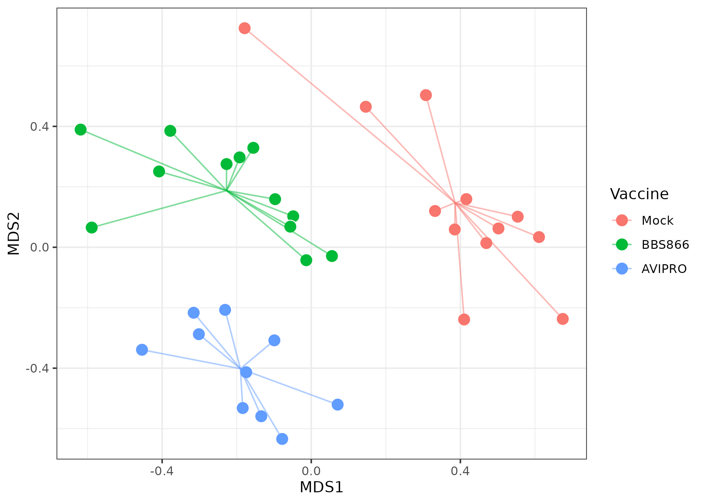
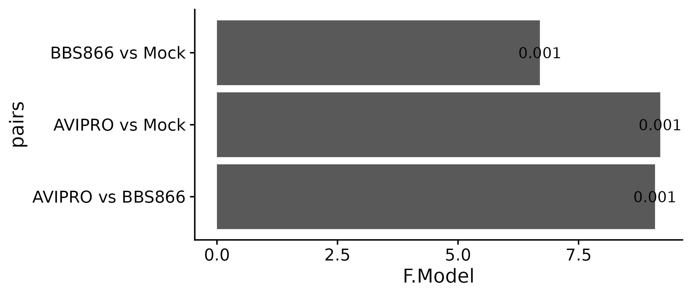

```{r setup, include=FALSE}
library(knitr)
library(kableExtra)
library(tidyverse)
knitr::opts_chunk$set(echo = TRUE)
```

# Sections {.tabset}

## Overall Impressions  

>  This dataset presents some very interesting challenges.  Each room appears to have a very different microbiome when compared to the others.  These differences are likely partially due to the different treatments assigned to each room, but we also cannot disregard the room effect.  

> Because these birds spent almost 2 months isolated in these rooms, we would expect the birds within rooms to be more similar to each other when compared to birds from other rooms.  I suspect that two rooms of birds treated identically byt isolated for 60 days would contain appreciably different microbial communities. Overall this means we need to be careful when discussing our findings.  


## Methods and QC


- ASVs were generated with DADA2  
- Phylogenetic classification with SILVA v138 
- Decontamination was performed with the R package 'decontam'  
  - Removes likely contaminants by examining negative control samples  
- Examined overall similarity and removed a few poorly performing samples.  


### Reads per sample  


### Overall Sample Similarity  


### Post QC similarity  
 


## Vaccine effects pre-challenge  


> A. Vaccination effects on turkey microbiome
Samples: Post-vaccination/booster vaccination (oral), prior to Salmonella challenge
Question: did the vaccines alter the microbial composition of the turkey cecum (cecal contents)  

### Alpha diversity  


### NMDS  


  

### Differential Abundance  

  

### Differential Abundance  
#### only features significant in both vaccine groups  

  

  
  
## Infantis Challenge effects in Mock vaccine groups  


> B. Infantis Challenge effect on turkey microbiome
Samples: Mock-vaccinated/mock-challenged and mock-vaccinated/Infantis-challenged @ 10dpi
Question: did challenge with Salmonella Infantis alter the microbial composition of the turkey cecum (cecal contents)  

### Alpha Diverstiy
  

### NMDS  

  

### Differential abundance  

  


## Infantis Challenge effects in vaccine contexts  

### BBS866 Effects on infection  
  
  
>C. BBS 866 vaccination effect on Infantis-challenged turkey microbiome
Samples: Mock-vaccinated/Infantis-challenged and BBS866-vaccinated/Infantis-challenged
Question: Did BBS 866 vaccination modify the Infantis-induced alterations of the microbial composition of the turkey cecum (cecal contents)

>13 mock-vaccinated/Infantis-challenged turkeys at 10dpi:    Minfantis_D10 #1-13
VERSUS
14 BBS866-vaccinated/Infantis-challenged turkeys at 10dpi:    BBS866_OO_D10 #1-14  
  
  
### Alpha Diversity  


### NMDS  


### Differential Abundance  

  

### AVIPRO effect on infection  
  
>D. AviPro vaccination effect on Infantis-challenged turkey microbiome
Samples: Mock-vaccinated/Infantis-challenged and AviPro-vaccinated/Infantis-challenged
Question: Did AviPro vaccination modify the Infantis-induced alterations of the microbial composition of the turkey cecum (cecal contents)

>13 mock-vaccinated/Infantis-challenged turkeys at 10dpi:    Minfantis_D10 #1-13
VERSUS
14 -AviPro-vaccinated/Infantis-challenged turkeys at 10dpi:    Avipro_OO_D10 #1-14  
  

### Alpha Diversity  

  

### NMDS  


### Differential Abundance  


  
## Infantis Challenge effects across all groups  
  
### Alpha Diversity  

    


### Alpha Diversity Tests
```{r, echo=FALSE, message=FALSE, warning=FALSE, out.width='full'}
TABLE <- read_tsv('output/All_infantis_alpha_tests.tsv')
TABLE%>% mutate(across(where(is.numeric), .fns = ~signif(.x, 2))) %>% 
  kable(format = "html", table.attr = "style='width:100%;'") %>% 
  kableExtra::kable_styling()
```
  
  
### NMDS  

  
  
### PERMANOVAs  

  
  
### Shedding Data  


## Speculation Zone  

> Very interesting... Vaccines are associated with higher levels of Salmonella Infantis in the Cecal contents

> We observe significantly higher Salmonella Shedding in both AviPro and BBS866 vaccinated groups compared to Mock Vaccinated Infantis challenged group.

> We observe large differences in bacterial communities from cecal contents when comparing Infantis infected groups back to mock-infected controls.  The mock vaccinated are the most similar to the mock-challenged and both vaccine groups are quite different from the mock vaccine and each other.

> One way this could be interpreted is that each vaccine enhanced the 'Salmonella effect' on microbial communities.

> In summary, not only is vaccination associated with worse colonization, it is also associated with greater difference in microbial communities after Salmonella Infantis infection.


#### Wild Speculation zone:
> Could it be that being vaccinated enhanced the inflammatory immune response?
So when salmonella was encountered again, this enhanced immune response increased gut inflammation (which Salmonella loves) allowed more extensive colonization?

> Alternatively, could vaccination have effected microbial communities? Then these changed microbial communities were less effective at excluding Salmonella upon infection?

